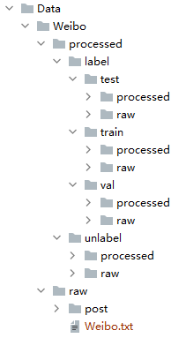

# 代码运行说明

1. 说明

运行```Process.process.py```进行数据的预处理

运行```Main.main.py```开始训练

Data文件夹如下：



2. 用到的一些命令

预处理数据集并训练词向量：
```shell script
nohup python process.py &
```

重新分配训练验证测试集（不必重新训练词向量）：
```shell script
nohup python process.py --no_step_two &
```

训练模型：
```shell script
nohup python main.py --dim 80 --batch_size 0 --gpu 0 &
```

# 实验记录

1. Weibo

 - 实验结果

| id | mode | use unsup | label limit num | unlabel limit num | clean | unlabel post num | word embedding size | graph embedding size | batch size | convergence epoch | val acc | test acc | test prec(T/F) | test rec(T/F) | f1(T/F) | 
| :----:| :----: | :----: | :----: | :----: | :----: | :----: | :----: | :----: | :----: | :----: | :----: | :----: | :----: | :----: | :----: |
| 1 | semi-sup | label,unlabel | 600 | no limit | 清理“转发微博”，清理“回复@” | 60198 | 100 | 80 | **8** | 43 | 0.936 | 0.961 | 0.959/0.963 | 0.959/0.963 | 0.959/0.963 |

- word embedding参数

| id | algo | word embedding size |train w2v post num | window | min count | epoch | vacab size |
| :----: | :----: | :----: | :----: | :----: | :----: | :----: | :----: |
| 1 | skip-gram | 100 | all label + 60198 unlabel | 5 | 5 | 10 | 10828 |
| 2 | skip-gram | 100 | all label + 60198 unlabel | 5 | 5 | 10 | 10828 |
| 3 | skip-gram | 100 | all label + 60198 unlabel | 5 | 5 | 10 | 10828 |
| 4 | skip-gram | 100 | all label + 60198 unlabel | 5 | 5 | 10 | 10828 |
| 5 | skip-gram | 100 | all label + 60198 unlabel | 5 | 5 | 10 | 10828 |
| 6 | skip-gram | 100 | all label + 60198 unlabel | 5 | 5 | 10 | 10828 |
| 7 | skip-gram | 100 | all label + 60198 unlabel | 5 | 5 | 10 | 10828 |
| 8 | skip-gram | 100 | all label + 60198 unlabel | 5 | 5 | 10 | 10828 |

2. Tweet

Waiting....

# 备注

1. 数据集id错误的修改

把微博数据集```3495745049431351.json```的源帖子```mid```改成了```3495745049431350```。

2. 微博标注数据集

处理后的微博标注数据集一般满足评论的id大于其父节点的id，但是有以下几个不满足帖子不满足：

| filename | cid | pid |
| :----:| :----: | :----: |
| 3521098215849074.json | 6429 | 6430 |
| 3567091888659283.json | 1169 | 1172 |
| 3515863422717161.json | 12325 | 12328 |
| 3515863422717161.json | 12621 | 12624 |
| 3512941028164269.json | 4781 | 4782 |

cid: comment id

pid: parent id

